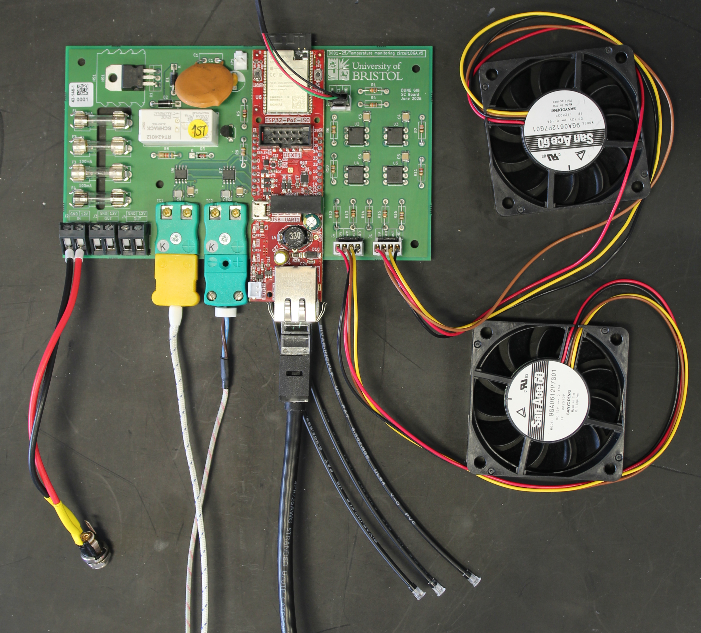

# Design files for DUNE Timing System GIB Slow Control Board

### Current version: PCB_Health.v5 

### Files produced with KiCAD 10.0

Design information in hardware/KiCAD

David.Cussans@bristol.ac.uk , 9/June/26
 
Directory with Gerber artwork: Gerber.D001-25.DGA.V5 

Component placement (CSV and Gerber): PCB_Health.V5-all-pos.csv PCB_Health.V5-pnp_top.gbr PCB_Health.V5-pnp_bottom.gbr

BoM: PCB_Health.V5_BOM.xlsx . Version from Newbury: cleaned_full_bom_for_external_users.xlsx

4-layer board. FR4. 1.6mm  Newbury Electronics "PCB train" stack-up

Photograph of assembled board: 
